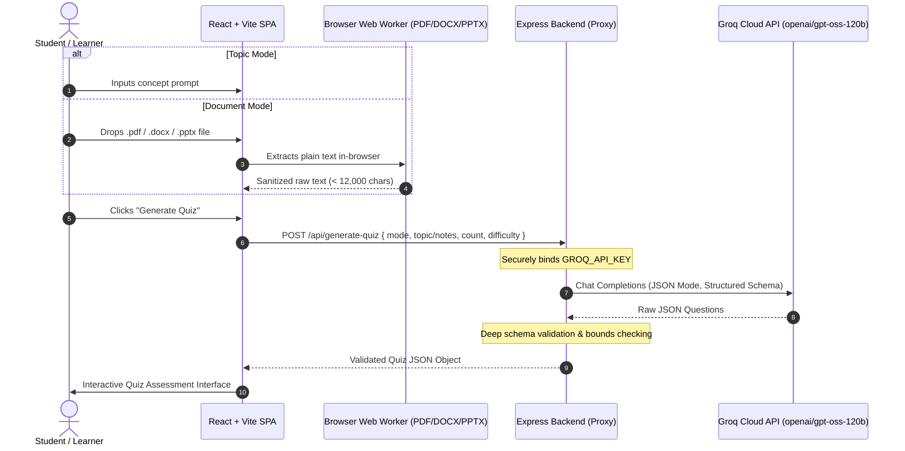

# AI Quiz Builder — Smart Assessments Powered by AI

[](https://reactjs.org/)
[](https://vitejs.dev/)
[](https://expressjs.com/)
[](https://groq.com/)
[](LICENSE)

An intelligent, full-stack assessment platform that generates interactive, curriculum-grade quizzes from open-ended topics or custom study documents (`.pdf`, `.docx`, `.pptx`, `.txt`) using high-speed LLM inference via Groq.

---

## ✨ Key Features

- **Dual Ingestion Engine**:
  - **Topic Prompts**: Formulate assessments from broad concepts (e.g., *System Design, React Internals, French Revolution*).
  - **Document Analysis**: In-browser text extraction supporting `.pdf`, `.docx`, `.pptx`, and `.txt` files with zero server round-trips for document parsing.
- **Configurable Parameters**:
  - Fine-grained question counts (3 to 15 questions).
  - Difficulty tiers (*Easy / Foundational*, *Medium / Standard*, *Hard / Advanced*).
  - Optional countdown timer (*Untimed*, *30s*, *45s*, *60s* per question).
- **Interactive Quiz Experience**:
  - Real-time linear progress tracking.
  - Keyboard navigation shortcuts (`A-D`, `1-4` to select; `Enter`/`Space` to advance).
  - Immediate visual feedback with pedagogical explanations for every item.
- **Detailed Analytics & Review Dashboard**:
  - Accuracy metrics, performance tiering, and animated score gauge.
  - Interactive question filters (*All*, *Missed*, *Correct*).
  - **"Retry Missed Questions"** flow for targeted practice.
  - One-click scorecard sharing to clipboard.
- **Performance Optimized**:
  - Dynamic code-splitting for heavy document parsers (`pdfjs-dist`, `mammoth`, `jszip`), yielding an 85% lighter initial entry bundle (< 55 kB gzipped).
  - Fully responsive, accessible (WCAG AA compliant), and modern dark SaaS theme.

---

## 🏛 Architecture & Data Flow



---

## 🛠 Tech Stack

### Frontend
- **Framework**: React 18 (SPA)
- **Bundler & Tooling**: Vite 5
- **Document Processing**:
  - `pdfjs-dist` (PDF extraction via Web Worker)
  - `mammoth` (DOCX extraction)
  - `jszip` (PPTX slide XML extraction)
- **Styling**: Modern CSS3 Custom Properties (Design System tokens, glassmorphism, responsive Grid/Flexbox)
- **Icons**: Custom scalable SVG icon suite

### Backend
- **Runtime**: Node.js (ES Modules)
- **Framework**: Express 4
- **CORS & Config**: `cors`, `dotenv`
- **AI Inference**: Groq Cloud API (`openai/gpt-oss-120b`) with JSON mode schema enforcement

---

## 🚀 Getting Started

### Prerequisites
- Node.js 18+ installed
- Free Groq Cloud API key from [console.groq.com](https://console.groq.com)

### 1. Clone & Setup Backend

```bash
cd ai-quiz-builder/backend
npm install
cp .env.example .env
```

Add your Groq API key in `backend/.env`:
```env
GROQ_API_KEY=gsk_your_groq_api_key_here
PORT=3001
```

Start the backend server:
```bash
npm run dev
# Running on http://localhost:3001
```

### 2. Setup Frontend

In a separate terminal:
```bash
cd ai-quiz-builder/frontend
npm install
npm run dev
```

Open the printed Vite URL (typically `http://localhost:5173`) in your browser.

---

## 📦 Production Build

```bash
# Build frontend assets
cd ai-quiz-builder/frontend
npm run build

# Preview build locally
npm run preview
```

---

## 🔒 Security & Best Practices

- **Zero Client-Side Secrets**: Groq API credentials reside exclusively on the Express backend service.
- **Client-Side Document Parsing**: User files are processed in-memory in the client's browser rather than uploaded to remote storage, preserving data privacy.
- **Schema Validation**: Upstream LLM responses are parsed and strictly checked for array bounds, option validity, and correct index ranges before reaching client state.
